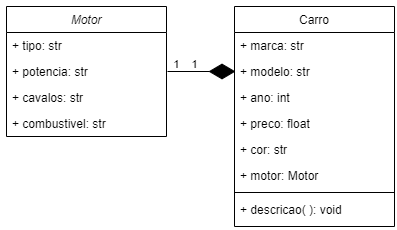
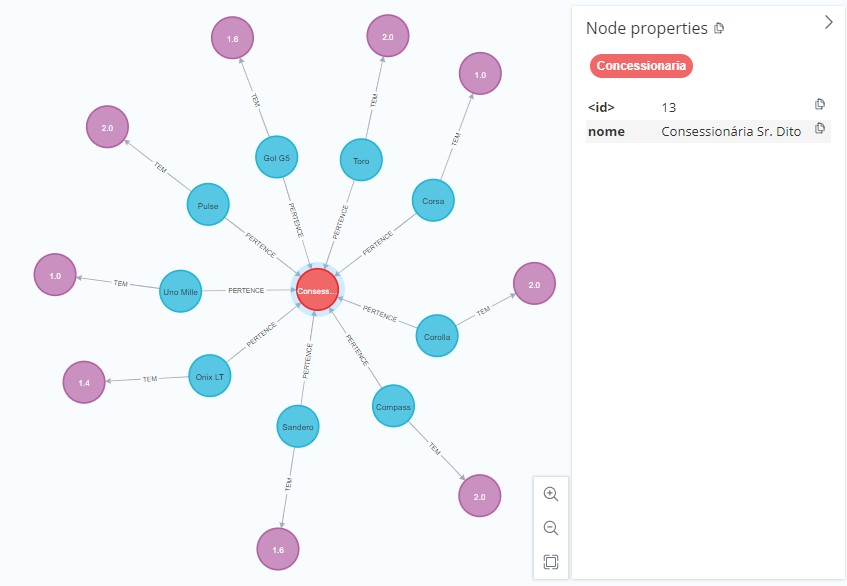

# 🚙 Bem-vindo à Concessionária do Sr. Dito 🚗

Nossa proposta é desenvolver um sistema eficiente para a gestão de uma concessionária de veículos. Com um conjunto de veículos já pré-cadastrados no nosso banco de dados, optamos por utilizar o NEO4J para proporcionar uma visibilidade mais clara para os administradores. A seguir, detalharemos um pouco mais sobre o funcionamento do nosso projeto.

  

# Diagrama de Classe

O diagrama de classe utilizado representa as características fundamentais do carro e do motor. Como o motor é uma parte integrante do carro, aplicamos o método de composição para demonstrar essa relação.

  

# NEO4J

Dentro do Neo4J, já existem alguns veículos cadastrados para venda como é possível observar pela imagem. 

  

No entanto, caso algum funcionário do Sr. Dito deseje efetuar alguma alteração, venda, inserção ou atualização, ele pode utilizar a linha de comando que será tratado logo abaixo

# Interface de Linha de Comando (CLI) 

Na interface de linha de comando, o administrador da concessionária dispõe de uma variedade de comandos para gerenciar o sistema. O comando 'Create' permite adicionar um novo veículo ao sistema, enquanto 'Update' serve para atualizar as informações de um veículo já existente, com o comando 'Read', é possível consultar os detalhes de um veículo à venda no sistema, e 'Delete' é utilizado para excluir um veículo que já foi vendido. Adicionalmente, o comando 'Quit' garante a finalização segura do sistema.

  

# Equipe de Desenvolvimento

Nossa equipe de desenvolvedores está orgulhosos de apresentar a você a Concessionária do Sr. Dito.
Desenvolvedores: 

| Nome | Curso | Github |
| :---: | :---: | :---: |
| Álvaro Lúcio Almeida Ribeiro | 163 - Engenharia de Software |  |
| Ewel Fernandes Pereira | 167 - Engenharia de Software |  |

# Apresentação

Confira o vídeo a seguir, que leva diretamente para o conteúdo no YouTube.

  

